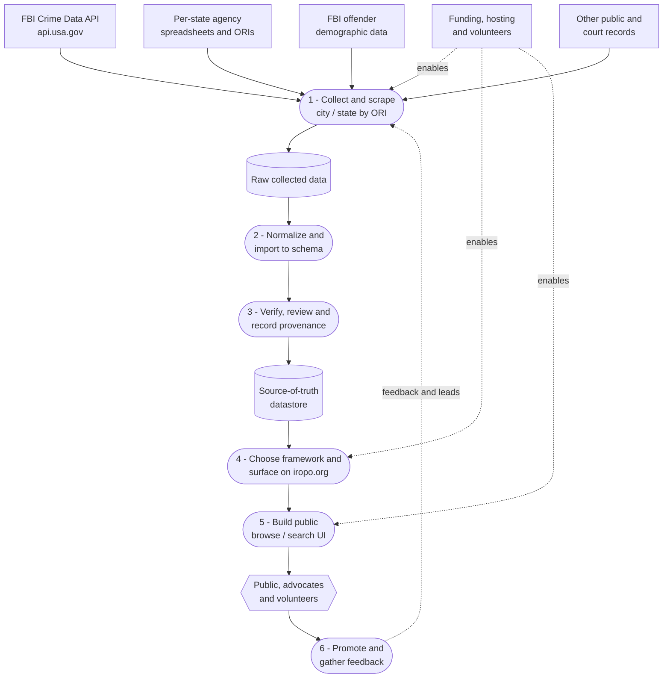

# IROPO — International Registry of Pet Offenders

IROPO is an animal-welfare advocacy project focused on documenting and tracking people who have harmed animals using public and official data sources.

> 🚧 **Work in progress:** the project is actively being built. The current focus is developing a data-mining and scraping pipeline to gather offender data for each city and state across the United States. The code is not yet functional or ready for general use.

## What is IROPO?

IROPO stands for the **International Registry of Pet Offenders**. The long-term concept is a registry that lists people who have caused harm or affliction to animals, with the goal of supporting animal-welfare advocacy and accountability.

The repository currently holds work-in-progress code, research notes, reference material, and sample source files that shape the data pipeline and the future direction of the project.

## Project status

This repository is an active work in progress and not yet a finished website or production data service. It is currently being used to:

- collect and evaluate candidate data sources
- understand how available FBI and agency datasets are structured
- build and test import workflows using ORI-based lookups
- carry out the work needed to build a reliable, reviewable source of truth

The current priority is data aggregation work across the US, starting city-by-city and state-by-state with states already represented in this repository.

## Mission and goals

The project objectives that guide the work here are:

- **Allocate funds and resources to help build the site.** Identify the time, tools, hosting, legal review, and volunteer capacity needed to keep the project moving forward.
- **Gather varying data sources into one primary source of truth.** Evaluate public and official records, normalize them into a consistent format, and document where each record came from.
- **Decide on a framework to surface data on iropo.org.** Assess whether the project should remain static, use GitHub Pages for limited publishing, or move to an application-backed site.
- **Build out the interface.** Design a usable public experience for browsing, searching, and understanding the data once sourcing and verification are mature enough.
- **Promote across social media.** Build awareness, attract volunteers and subject-matter expertise, and create feedback loops with animal-welfare communities.

## Data sources

Known data sources and references already present in this repository include:

- **FBI Crime Data Explorer / NIBRS documentation**  
  <https://crime-data-explorer.fr.cloud.gov/pages/docApi>
- **FBI Crime Data API via api.usa.gov** for animal-cruelty offender counts and related lookups
- **NCIC ORI numbers** used to identify reporting agencies
- **Per-state agency spreadsheets** such as `localAndStateAgencies-NC.xlsx`, `localAndStateAgencies-ND.xlsx`, and `localAndStateAgencies-NY.xlsx`
- **FBI offender demographic spreadsheets** in `Offenders/`
- **Reference manuals and PDFs** that help interpret identifiers, agency data, and public-record workflows

### What is an ORI?

An **ORI** is a nine-character **Originating Agency Identifier** used in NCIC and related criminal-justice reporting systems to identify a reporting agency. The working notes in this repository use ORIs to look up agencies and query the FBI API.

## Repository structure

| Path | Purpose |
| --- | --- |
| `README.md` | Project overview, status, and roadmap |
| `CONTRIBUTING.md` | Contributor guidance for this repository |
| `iropo.org.md` | Working notes about sources, ORIs, and API research |
| `api-test.py` | Script that reads an agency spreadsheet and queries the FBI API by ORI (in development) |
| `api-test-columns.py` | Script for inspecting spreadsheet columns (in development) |
| `localAndStateAgencies-*.xlsx` | Agency and ORI lists for states currently being explored |
| `Offenders/` | FBI demographic spreadsheets related to offender data |
| `*.pdf`, `*.rtf` | Reference material and manuals used during research |
| `.github/workflows/` | Workflow-dispatch jobs for the Python scripts |

## Data scripts

The Python files in this repository are part of the data-collection work that is still being built. They are not ready for general or widespread use yet and may be incomplete or change significantly as development continues. Setup and usage instructions will be added here once the scripts are stable enough to run reliably.

## Security and secrets

- Never commit API keys, access tokens, account IDs, or personal account email addresses.
- Use a local `.env` file for development and GitHub Actions secrets for automation.

## Data flow and growth plan

The diagram below shows the intended data flow and the high-level steps for growing the project: from gathering source data, through normalization and verification into a single source of truth, and on to presenting it publicly and gathering feedback. Most of this pipeline is still being built.

## Roadmap / TODO

The following checklist tracks the work based on the current objectives and the repository's present state.

### Funding & resources

- [ ] Identify the funds, hosting, tooling, and operational resources needed to build and maintain the project.
- [ ] Identify volunteers, contributors, and partner organizations who can help with research, legal review, engineering, design, and moderation.
- [ ] Clarify which responsibilities require subject-matter expertise before any public launch.

### Data aggregation (current focus)

- [ ] Define the canonical schema for an offender or case record, including fields, identifiers, source references, and dates.
- [ ] Catalog and evaluate candidate data sources, including FBI NIBRS animal-cruelty data, state and local agency records, and other public court or records systems.
- [ ] Build a US city/state coverage matrix to track where data sources exist and how complete they are.
- [ ] Build scrapers and importers for city-by-city and state-by-state collection, starting with the states already represented here: NC, ND, and NY.
- [ ] Establish a verification workflow and a single source-of-truth datastore for reviewed records.
- [ ] Define processes for accuracy review, corrections, removals, and dispute handling.
- [ ] Record data provenance for every imported record so contributors can trace where information came from.

### Framework & architecture

- [ ] Decide on the framework and deployment model for presenting data on `iropo.org`.
- [ ] Evaluate whether GitHub Pages should remain part of the publishing strategy or whether a database-backed application is needed.
- [ ] Design the data storage model, ingestion pipeline, and update cadence.
- [ ] Define whether the project needs a public API or another structured access layer.

### Build the interface

- [ ] Build the public-facing interface for browsing and searching the registry.
- [ ] Implement search and filtering by location, name, offense type, and source metadata.
- [ ] Add accessibility, responsive design, and basic SEO considerations from the start.
- [ ] Provide clear source citations, status indicators, and correction/reporting affordances in the UI.

### Launch & outreach

- [ ] Set up analytics, contact paths, and contributor/user feedback mechanisms.
- [ ] Promote the project across social media and relevant animal-welfare communities.
- [ ] Establish an ongoing maintenance plan for updates, reviews, corrections, and archival decisions.
- [ ] Publish clear expectations for what has and has not yet been verified when data begins to appear publicly.

## How to contribute

Contributions are welcome. Helpful contributions may include:

- identifying or documenting public/official data sources
- improving the data-collection scripts and import approach
- proposing schema, verification, or correction workflows
- helping plan the site architecture and public interface
- reviewing documentation for clarity and scope

Please start with [`CONTRIBUTING.md`](CONTRIBUTING.md) and follow the community expectations in [`CODE_OF_CONDUCT.md`](CODE_OF_CONDUCT.md). If you want to help shape the project process further, open an issue to discuss it.

## Legal & ethical considerations

Because this project concerns information about identifiable people and alleged or adjudicated harm to animals, contributors should work carefully and conservatively:

- data should come from public, official, or otherwise reviewable records
- accuracy, verification, and provenance matter more than speed
- any eventual public listing should have a correction or removal path
- contributors should be mindful of privacy, defamation, and jurisdiction-specific legal risks when handling or publishing information

These points are not legal advice; they are considerations that should be addressed before any public registry is treated as authoritative.

## License

This project is licensed under [CC0-1.0](LICENSE).

## Contact / community

If you want to help, use GitHub issues or pull requests for now. Additional contact or community channels can be added here later if the project adopts a mailing list, GitHub Discussions, or another option.
