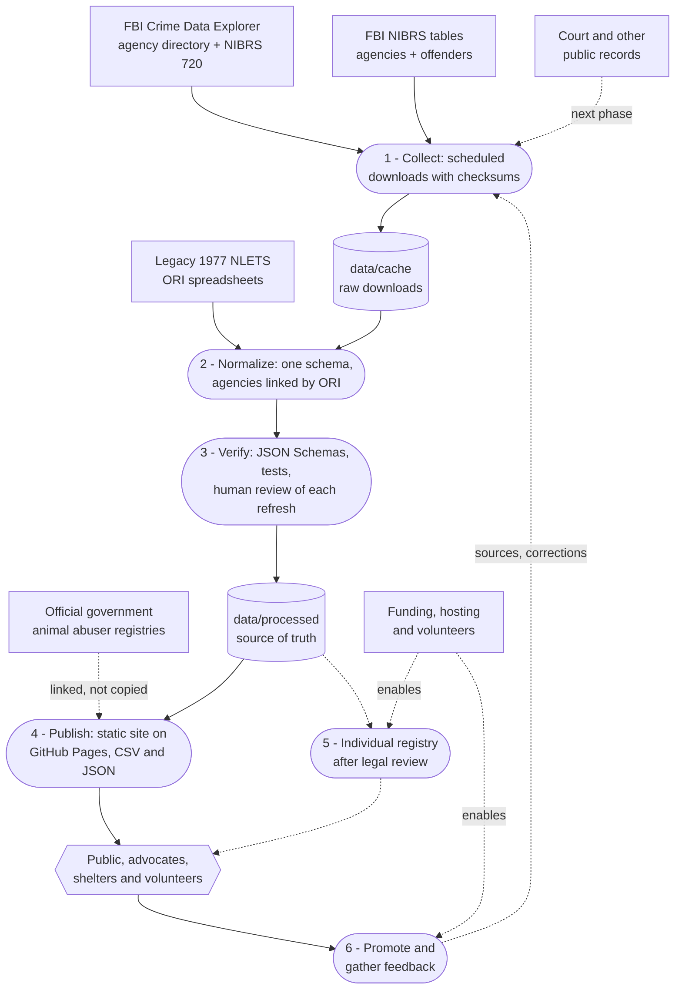

# IROPO — International Registry of Pet Offenders

IROPO is an animal-welfare advocacy project that documents animal cruelty in the United States and beyond using public and official data sources, with the long-term goal of a trustworthy registry of people who have harmed animals.

**Live site: [iropo.org](https://iropo.org)**

> 🚧 **Work in progress:** the website and data pipeline are live and publish **aggregate** statistics from official FBI data for all 50 states and the District of Columbia. **No individuals are listed.** Individual records will only be published after the legal review, verification workflow and correction process described in the [registry policy](https://iropo.org/registry/) are in place.

## What is IROPO?

IROPO stands for the **International Registry of Pet Offenders**. The long-term concept is a registry that lists people who have caused harm or affliction to animals, supporting animal-welfare advocacy, safer adoptions and accountability.

Today the project:

- **publishes official statistics** on animal cruelty (NIBRS offense code 720) nationally and for every state, from 2016, when animal cruelty became its own offense category, to the latest full year;
- **links 19,600+ law enforcement agencies** in the FBI directory to the animal cruelty offenses each reported, year by year;
- **shows who is reported** (offender age, sex, race and adult/juvenile status) compared with all offenses;
- **tracks coverage and data quality** for every state, including reporting gaps;
- **links to official, government-run animal abuser registries** instead of copying their listings;
- **defines the record format and publication rules** for a future registry of adjudicated cases.

### Scope: the United States and beyond

IROPO covers the United States today. Beyond the US, the scope is deliberately limited to the only countries with more people than the United States: **China** and **India**. Together with the US, they are the world's three most populous countries.

Laws on animal cruelty, court records and personal data differ from country to country, and many are much stricter than in the US. Each country needs its own legal review and source evaluation, including its data protection law (China's Personal Information Protection Law and India's Digital Personal Data Protection Act, 2023), before any of its data is published. Keeping the list short keeps that work manageable. Other countries are out of scope. See [Beyond the United States](#beyond-the-united-states) in the roadmap.

## The website

| Page | What it shows |
| --- | --- |
| [Home](https://iropo.org/) | Headline figures, a map of rates by state, offender highlights and how the project works |
| [Data](https://iropo.org/data/) | National trends, rates, clearances, seasonality, offender demographics and the agencies reporting the most cases |
| [States](https://iropo.org/states/) | A profile for every state and DC, plus a searchable directory of each state's agencies with their ORIs |
| [Agencies](https://iropo.org/agencies/) | Nationwide search by agency name, city, county or ORI |
| [Registry](https://iropo.org/registry/) | Publication policy, record format and official government registries |
| [Coverage](https://iropo.org/coverage/) | The US coverage matrix: what data exists for each state and how complete it is |
| [Sources](https://iropo.org/sources/) | Provenance, methodology, CSV and JSON downloads, and the reference library |
| [Roadmap](https://iropo.org/roadmap/) | Phased plan with what is done and what comes next |
| [Contact](https://iropo.org/contact/) | A contact form that emails the project, plus the GitHub forms for sources, corrections and volunteers |

All data is available as CSV and static JSON (for example `https://iropo.org/data/states.json` or `https://iropo.org/data/agencies/NC.json`), dedicated to the public domain.

## Project status

The website is a static site built with [Astro](https://astro.build) and deployed to GitHub Pages. Its data comes from a Python pipeline that downloads official FBI data, normalizes it into one schema, links agencies by ORI, validates everything against JSON Schemas and writes the source of truth to [`data/processed/`](data/processed). A scheduled workflow checks for new FBI data every month and proposes updates as a pull request for human review.

The current priorities are evaluating court-record sources state by state, and completing the legal, governance and verification groundwork required before any individual record is published.

## Mission and goals

- **Allocate funds and resources to help build the site.** Identify the time, tools, hosting, legal review and volunteer capacity needed to keep the project moving forward.
- **Gather varying data sources into one primary source of truth.** Evaluate public and official records, normalize them into a consistent format and document where each record came from.
- **Decide on a framework to surface data on iropo.org.** ✅ Decided: a static site on GitHub Pages, generated from a versioned, validated dataset. A database-backed application can be added when individual records require it.
- **Build out the interface.** ✅ A public, accessible experience for browsing, searching and understanding the data.
- **Promote across social media.** Build awareness, attract volunteers and subject-matter expertise, and create feedback loops with animal-welfare communities.

## Data sources

| Source | Used for |
| --- | --- |
| [FBI Crime Data Explorer](https://cde.ucr.cjis.gov/) agency directory (`/agency/byStateAbbr/{state}`) | ORIs, names, types, counties, coordinates and NIBRS status for every agency |
| FBI Crime Data Explorer NIBRS series (`/nibrs/{national,state}/720`) | Monthly animal cruelty offenses, clearances, rates and population coverage since 2016 |
| FBI NIBRS Tables: *Offense Type by Agency* (2020 onward) | Animal cruelty offenses reported by each agency, per year |
| FBI NIBRS Tables: *Offenders* (2020 onward) | Offender age, sex, race and adult/juvenile status |
| [`data/curated/official-registries.json`](data/curated/official-registries.json) | Catalog of government-run animal abuser registries (links only) |
| Legacy spreadsheets in [`data/raw/legacy/`](data/raw/legacy) | NC, ND and NY agency lists transcribed from the 1977 NLETS directory, cross-checked against today's ORIs |
| Reference manuals in [`docs/reference/`](docs/reference) | NCIC and GCIC operating manuals, the NLETS directory and background reading |

No API key is required. The pipeline uses the public backend of the Crime Data Explorer by default, or the documented `api.usa.gov` gateway when `FBI_API_KEY` is set. See [`pipeline/README.md`](pipeline/README.md) for details.

### What is an ORI?

An **ORI** is a nine-character **Originating Agency Identifier** used in NCIC and related criminal-justice reporting systems to identify a reporting agency. For example, the New York City Police Department is `NY0303000`. IROPO uses ORIs as the key that joins agency records across sources.

## Repository structure

| Path | Purpose |
| --- | --- |
| `src/` | Astro website: pages, components, charts, styles and client scripts |
| `worker/` | Cloudflare Worker behind the contact form, and its tests |
| `public/` | Static assets (favicon, social image, `CNAME`, `robots.txt`) |
| `pipeline/` | Python data pipeline (`iropo-data` CLI) and its tests |
| `data/processed/` | Source-of-truth datasets built by the pipeline and read by the site |
| `data/curated/` | Hand-maintained inputs: official registry catalog and the (empty) registry records file |
| `data/schema/` | JSON Schemas, including the canonical registry record |
| `data/raw/legacy/` | Original spreadsheets and 2020 FBI files kept for provenance |
| `docs/` | Research notes and reference manuals |
| `.github/workflows/` | CI, GitHub Pages deployment and the monthly data refresh |
| `BUSINESS_PLAN.md` | Scope, implementation and funding plan |

## Development

Requirements: Node.js 22.12+ (see `.nvmrc`) and, for the data pipeline, Python 3.11+ with [uv](https://docs.astral.sh/uv/).

```bash
# Website
npm install
npm run dev        # http://localhost:4321
npm run check      # type-check Astro and TypeScript
npm run build      # static site in dist/

# Data pipeline
cd pipeline
uv sync
uv run iropo-data all      # fetch FBI data, rebuild data/processed, validate
uv run pytest              # unit tests
uv run ruff check .        # lint
```

The site reads only `data/processed/`, so you can work on it without running the pipeline.

### Deployment and automation

- **Deploy site** builds and publishes to GitHub Pages on every push to `main`.
- **CI** runs the pipeline's lint, tests and data validation plus the site's type check and build, and type-checks and tests the contact form Worker, on pull requests.
- **Refresh FBI data** runs monthly (and on demand), rebuilds `data/processed` and opens a pull request with any changes. It requires *Allow GitHub Actions to create and approve pull requests* in the repository's Actions settings, and optionally an `FBI_API_KEY` secret.

### Contact form

The site is static, so the [contact form](https://iropo.org/contact/) posts to a small Cloudflare Worker in [`worker/`](worker). iropo.org's DNS is on Cloudflare, which proxies the site from GitHub Pages and runs the Worker on `iropo.org/api/*` only. The Worker checks each message (allowed origin, field validation, a honeypot field, a minimum fill time, a link limit and a per-IP rate limit), then emails it through Cloudflare Email Routing with the sender as Reply-To. It stores nothing. Without JavaScript the form still works: the Worker redirects to `/contact/sent/` or shows an error page.

Messages go to the Worker's `CONTACT_TO` secret, which must be a verified destination address in Email Routing. The Worker is deployed by hand:

```bash
cd worker
npx wrangler@4 login                      # once
npx wrangler@4 deploy
npx wrangler@4 secret put CONTACT_TO      # only when the destination changes
node --test "test/*.test.mjs"             # unit tests (Node 23.6+)
```

## Security and secrets

- Never commit API keys, access tokens, account IDs or personal account email addresses.
- `FBI_API_KEY` is optional. Use a local `.env` file (see `.env.example`) for development and a GitHub Actions secret for automation.
- The contact form's destination address lives only in the Worker's `CONTACT_TO` secret. Never commit it.
- Never commit unverified records about individuals to this public repository.

## Data flow and growth plan

The diagram shows how data moves from official sources, through normalization and verification into a single source of truth, and out to the public, with feedback flowing back into source discovery.


```mermaid
flowchart TD
    %% External data sources
    FBI[FBI Crime Data Explorer<br/>agency directory + NIBRS 720]
    TAB[FBI NIBRS tables<br/>agencies + offenders]
    REG[Official government<br/>animal abuser registries]
    PUB[Court and other<br/>public records]
    LEG[Legacy 1977 NLETS<br/>ORI spreadsheets]

    %% Enabling resources
    FUND[Funding, hosting<br/>and volunteers]

    %% Processes / growth steps
    P1([1 - Collect: scheduled<br/>downloads with checksums])
    P2([2 - Normalize: one schema,<br/>agencies linked by ORI])
    P3([3 - Verify: JSON Schemas, tests,<br/>human review of each refresh])
    P4([4 - Publish: static site on<br/>GitHub Pages, CSV and JSON])
    P5([5 - Individual registry<br/>after legal review])
    P6([6 - Promote and<br/>gather feedback])

    %% Data stores
    RAW[(data/cache<br/>raw downloads)]
    SOT[(data/processed<br/>source of truth)]

    %% End users
    USERS{{Public, advocates,<br/>shelters and volunteers}}

    FBI --> P1
    TAB --> P1
    LEG --> P2
    REG -.->|linked, not copied| P4
    PUB -.->|next phase| P1

    P1 --> RAW
    RAW --> P2
    P2 --> P3
    P3 --> SOT
    SOT --> P4
    P4 --> USERS
    SOT -.-> P5
    P5 -.-> USERS
    USERS --> P6
    P6 -.->|sources, corrections| P1

    FUND -.->|enables| P5
    FUND -.->|enables| P6
```

## Business plan

A working [`BUSINESS_PLAN.md`](BUSINESS_PLAN.md) lays out the full scope of the project as a business: what IROPO will offer, how it will be implemented and how it will be funded. It expands on the "Mission and goals" and "Roadmap / TODO" sections and should be kept in sync with them.

## Roadmap / TODO

The [roadmap page](https://iropo.org/roadmap/) tracks the same milestones.

### Funding & resources

- [ ] Identify the funds, hosting, tooling and operational resources needed to build and maintain the project.
- [ ] Identify volunteers, contributors and partner organizations who can help with research, legal review, engineering, design and moderation.
- [ ] Clarify which responsibilities require subject-matter expertise before any public launch.

### Data aggregation (current focus)

- [x] Define the canonical schema for an offender or case record, including fields, identifiers, source references and dates ([`registry-record.schema.json`](data/schema/registry-record.schema.json)).
- [x] Catalog and evaluate FBI NIBRS animal cruelty data and the FBI agency directory.
- [ ] Catalog and evaluate state and local court or records systems.
- [x] Build a US state coverage matrix ([iropo.org/coverage](https://iropo.org/coverage/)).
- [x] Build importers for every state and DC, replacing the NC, ND and NY spreadsheets (which are kept and cross-checked).
- [x] Establish a single source-of-truth datastore (`data/processed`) validated against JSON Schemas.
- [ ] Establish a two-person verification workflow and private intake store for individual records.
- [x] Define processes for accuracy review, corrections, removals and dispute handling ([iropo.org/corrections](https://iropo.org/corrections/)).
- [x] Record data provenance for every dataset (URLs, retrieval times, checksums).

### Framework & architecture

- [x] Decide on the framework and deployment model: Astro static site on GitHub Pages.
- [x] Keep GitHub Pages as the publishing strategy for aggregate data; add a database-backed service only when individual records require it.
- [x] Design the data storage model, ingestion pipeline and update cadence (monthly, reviewed via pull request).
- [x] Provide a structured access layer: CSV downloads and a static JSON API.

### Build the interface

- [x] Build the public-facing interface for browsing and searching states and agencies.
- [x] Implement search and filtering by location, agency name, ORI and agency type.
- [ ] Implement search for individual records (after legal review).
- [x] Add accessibility, responsive design and basic SEO from the start.
- [x] Provide source citations, data-quality indicators and correction/reporting affordances in the UI.

### Launch & outreach

- [ ] Set up privacy-respecting analytics.
- [x] Set up contact paths and feedback mechanisms (GitHub issue forms for sources, corrections and volunteers, and a [contact form](https://iropo.org/contact/)).
- [ ] Promote the project across social media and relevant animal-welfare communities.
- [ ] Establish an ongoing maintenance plan for reviews, corrections and archival decisions (the monthly data refresh is automated).
- [x] Publish clear expectations for what has and has not been verified.

### Beyond the United States

- [x] Limit the scope beyond the US to the only countries with more people: China and India ([iropo.org/about](https://iropo.org/about/#scope)).
- [ ] Obtain a legal review for each country covering animal cruelty, court record and personal data law.
- [ ] Catalog and evaluate official animal cruelty data and court record sources in China and India.
- [ ] Recruit volunteers and partners with legal and language expertise in each country.
- [ ] Extend the schemas, pipeline and site to jurisdictions outside the US. The registry record schema already accepts only `US`, `CN` and `IN` as countries.

## How to contribute

Contributions are welcome, especially:

- identifying or documenting public/official data sources (court portals, registries, agency data);
- improving the data pipeline and importers;
- reviewing schema, verification or correction workflows;
- improving the website's design, accessibility and explanations;
- legal expertise on privacy, defamation and records law.

Start with [`CONTRIBUTING.md`](CONTRIBUTING.md) and follow the [`CODE_OF_CONDUCT.md`](CODE_OF_CONDUCT.md). Use the issue forms to [suggest a source](https://github.com/the-robots/iropo.org/issues/new?template=data-source.yml), [report a correction](https://github.com/the-robots/iropo.org/issues/new?template=correction.yml) or [volunteer](https://github.com/the-robots/iropo.org/issues/new?template=volunteer.yml).

## Legal & ethical considerations

Because this project concerns information about identifiable people and alleged or adjudicated harm to animals, contributors should work carefully and conservatively:

- data should come from public, official or otherwise reviewable records;
- accuracy, verification and provenance matter more than speed;
- any eventual public listing must have a correction or removal path;
- each country in scope (the United States, China and India) needs its own legal review, because privacy and records laws differ by country;
- contributors should be mindful of privacy, defamation and jurisdiction-specific legal risks when handling or publishing information.

These points are not legal advice; they must be addressed before any public registry is treated as authoritative.

## License

This project is licensed under [CC0-1.0](LICENSE). FBI data is a U.S. government work in the public domain.

## Contact / community

Send the project a message with the [contact form](https://iropo.org/contact/), or use [GitHub issues](https://github.com/the-robots/iropo.org/issues) and pull requests for anything that can be public. Additional channels can be added if the project adopts a mailing list, GitHub Discussions or another option.
